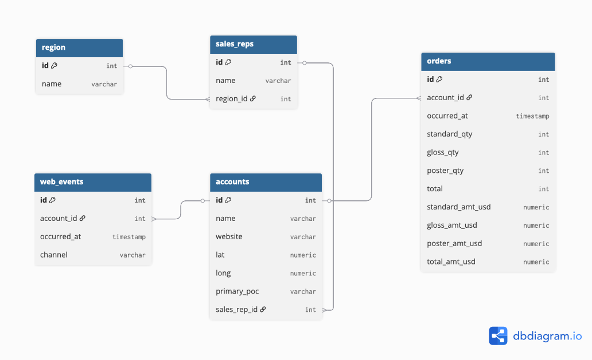

# CDE Posey Analysis

## Table of Contents
1. [Project Overview](#1-project-overview)
2. [Setup Instructions](#2-setup-instructions)
3. [Database Schema & ERD](#3-database-schema--erd)
4. [Exploratory Analysis](#4-exploratory-analysis)
   - [Overall Revenue KPIs](#41-overall-revenue-kpis)
   - [Top Customers](#42-top-customers)
   - [Regional Performance](#43-regional-performance)
   - [Product Mix by Region](#44-product-mix-by-region)
   - [Marketing Channels](#45-marketing-channels)
   - [Sales Rep Performance](#46-sales-rep-performance)
5. [Presentation](#5-presentation)


## 1. Project Overview
This project is part of the Core Data Engineers Bootcamp group assignment.
We analysed the Posey database (2013–2017) to:
1. Explore sales, accounts, regions, reps, and marketing events.
2. Derive business insights from exploratory SQL queries.
3. Present findings in a PowerPoint deck for management.


----

## 2. Setup Instructions
1. Clone the repository:
   ```bash
   git clone https://github.com/CDE-Bootcamp-circle-14/CDE_Posey_Analysis.git
   cd CDE_Posey_Analysis
   ```
2. Start Postgres + Adminer with Docker:
   ```bash
   docker-compose up -d
   ```
3. Run the setup guide in [`set.md`](set.md) to configure `.env`, load data, and access Adminer.
4. Queries are located in the `sql/` folder. Results should be exported to `/results/` as CSVs.
## 3. Database Schema & ERD
The Posey database includes the following core tables:
* `accounts`
* `sales_reps`
* `region`
* `orders`
* `web_events`*




-----

## 4. Exploratory Analysis
### 4.1 Overall Revenue KPIs
[`sql/1_kpis_totals.sql`](sql/1_kpis_totals.sql)
* Orders: \~6,900
* Revenue: \$23.1M
* Average Order Value ≈ \$3.3k
### 4.2 Top Customers
[`sql/2_top_customers.sql`](sql/2_top_customers.sql)
* Top accounts include EOG Resources, Mosaic, IBM
* Revenue highly concentrated in top 10 customers
### 4.3 Regional Performance
[`sql/3_region_performance.sql`](sql/3_region_performance.sql)
* Northeast and Southeast regions dominate revenue
* Midwest and West consistently smaller
### 4.4 Product Mix by Region
SQL: [`sql/4_product_by_region.sql`](sql/4_product_by_region.sql)
* Northeast and Southeast: balanced mix
* West: poster-heavy
* Midwest: mostly standard
### 4.5 Marketing Channels
[`sql/5_channnel_engagement.sql`](sql/5_channnel_engagement.sql)
* Direct and organic channels dominate
* Paid/social channels smaller and volatile
### 4.6 Sales Rep Performance
[`sql/6_sales_rep_performance.sql`](sql/6_sales_rep_performance.sql)
* Top 10 reps generate majority of revenue
* Earlie Schleusner (SE) and Tia Amato (NE) exceed \$1M

----

## 5. Presentation
Final slides are located in:
```
presentation/Posey_Analysis_Presentation.pptx
```
Each slide maps directly to one SQL query and its exported chart.

---

## 6. Collaboration Workflow
1. Work is organised via feature branches.
2. Example: `feature/sql-queries` branch for SQL analysis.
3. Each member contributes through Pull Requests.
4. Reviews ensure consistent style and accuracy.
